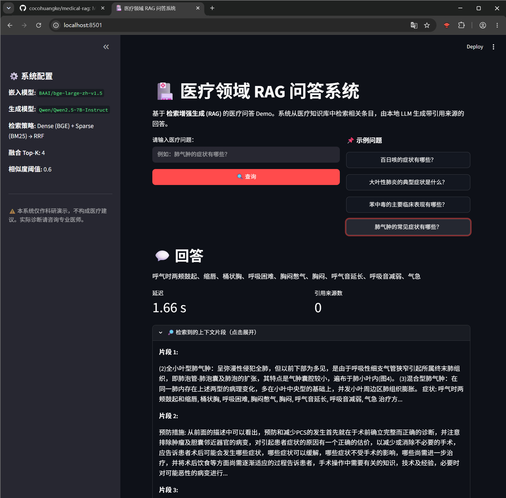

# 医疗领域 RAG（检索增强生成）系统

> 一个面向医疗问答的检索增强生成（RAG）系统，旨在探究「混合检索 + 引用感知生成」能否在中文医疗语料上缓解 LLM 医疗问答的幻觉与低精度问题。

---

## 目录

- [项目概述](#项目概述)
- [动机](#动机)
- [系统架构](#系统架构)
- [仓库结构](#仓库结构)
- [安装](#安装)
- [使用](#使用)
- [评测](#评测)
- [结果](#结果)
- [项目状态](#项目状态)

---

## 项目概述

本项目将 **检索增强生成（RAG）** 应用于约 8,800 条中文疾病百科语料。系统通过 **稠密 + 稀疏混合检索**（Dense + Sparse）召回相关片段，再由 LLM（SiliconFlow `Qwen2.5-7B-Instruct`，OpenAI 兼容 API）在「显式要求引用来源」的提示词下生成答案。系统在固定的 50 例测试集上，从七个维度评测——准确率、语义相似度、忠实度、上下文相关性、答案完整度、幻觉率、延迟。

项目历经三个开发阶段：

1. **阶段一——核心流水线。** 混合检索（BGE 稠密 + BM25 稀疏，RRF 融合）、引用感知提示词、思维链过滤，模型从推理型 `deepseek-r1:1.5b` 切换到非推理型 `qwen2.5:7b`（经 SiliconFlow API 提供服务）。
2. **阶段二——评测框架。** 在单一准确率之外引入多维指标：忠实度、上下文相关性、答案完整度。
3. **阶段三——演示与文档。** Streamlit 前端、README、评测报告、海报修订。

---

## 动机

基线流水线（单阶段稠密检索 + 推理模型生成）在 50 例测试集上仅得 **14% 准确率** 和 **0.488 平均语义相似度**。根因分析定位到三个失败模式：

1. **推理链泄漏。** `deepseek-r1:1.5b` 输出 `⋖thinking≻…⋖/thinking≻` 块，稀释了余弦相似度——指标惩罚的是「推理过程」而非「答案本身」。
2. **检索召回弱。** 仅用稠密检索会漏掉词法上不同的片段，导致无关上下文进入 Top-K。
3. **单指标评测粗糙。** 只报告基于相似度的准确率，把检索遗漏、生成幻觉、覆盖不全混为一谈，难以定位下一步改进方向。

上述每一项都在升级后的流水线中得到了针对性修复（见[系统架构](#系统架构)）。完整的失败模式分析与改进依据见 [`docs/evaluation-report.md`](docs/evaluation-report.md)。

---

## 系统架构

```
┌──────────────────────────────────────────────────────────────────┐
│                        medical_rag_system.py                     │
│                                                                  │
│  ┌────────────┐    ┌──────────────────┐    ┌─────────────────┐   │
│  │ JSONL 数据 │───▶│ 递归切分器       │───▶│ 文档分块        │   │
│  │ (8.8k 条)  │    │ (400 / 80 重叠)  │    │ + 元数据        │   │
│  └────────────┘    └──────────────────┘    └────────┬────────┘   │
│                                                      │            │
│                       ┌──────────────────────────────┼──────┐     │
│                       ▼                              ▼      │     │
│              ┌───────────────┐              ┌──────────────┐ │     │
│              │ 稠密：BGE     │              │ 稀疏：BM25    │ │     │
│              │ + ChromaDB    │              │ (jieba 分词)  │ │     │
│              └───────┬───────┘              └──────┬───────┘ │     │
│                      │                             │         │     │
│                      └─────────────┬───────────────┘         │     │
│                                    ▼                         │     │
│                          ┌──────────────────┐                │     │
│                          │  RRF 融合 (k=60) │                │     │
│                          │  → top-4 片段    │                │     │
│                          └────────┬─────────┘                │     │
│                                   ▼                          │     │
│              ┌──────────────────────────────────┐            │     │
│              │ 引用感知问答提示词                │            │     │
│              │ → [来源: 疾病名称] 标记           │            │     │
│              └──────────────┬───────────────────┘            │     │
│                             ▼                                │     │
│              ┌──────────────────────────────────┐            │     │
│              │ clean_llm_output() + extract_    │            │     │
│              │ citations() → 答案 + 引用        │            │     │
│              └──────────────────────────────────┘            │     │
└──────────────────────────────────────────────────────────────────┘
```

### 关键组件

| 组件 | 实现 | 作用 |
|---|---|---|
| `Config` | 集中式常量（路径、切分大小、K 值、阈值） | 调参的唯一入口 |
| `load_medical_data()` | JSONL → LangChain `Document`（含 `{name, category, source}` 元数据） | 保留引用可追溯性 |
| `safe_vectorstore_creation()` | 分批写入 ChromaDB（100 文档/批） | 避免批量插入时的 HNSW 索引错误 |
| `BM25Retriever` | 基于 jieba 分词分块的 `rank_bm25.BM25Okapi` | 稀疏检索，捕捉 BGE 遗漏的词法匹配 |
| `reciprocal_rank_fusion()` | k=60 的 RRF，返回 top-4 | 融合稠密 + 稀疏排序 |
| `clean_llm_output()` | 正则剥离 `⋖thinking≻…⋖/thinking≻` 块 | 清除残留的推理链泄漏 |
| `extract_citations()` | 解析 `[来源: 疾病名称]` 标记，关联到召回文档 | 为 UI / 评测生成结构化引用 |
| `hybrid_retrieve()` | 稠密 + 稀疏 → RRF | 核心检索策略 |
| `ask_medical_question()` | 端到端问答，返回 `{answer, citations, latency, sources, contexts}` | 演示 + 评测的公共 API |
| `evaluate_rag_system()` | 50 例上的 7 维指标 | 诚实、多维评测 |

---

## 仓库结构

```
medical-rag/
├── medical_rag_system.py        # 核心流水线 + 评测
├── app.py                       # Streamlit 演示
├── docs/
│   ├── evaluation-report.md     # 完整评测方法 + 结果
│   ├── medical-rag-en.md        # 项目文档英文版
│   ├── poster-text-revisions.md # 海报表述修正
│   ├── UPGRADE_PLAN.md          # 三阶段开发计划
│   ├── medical_rag.docx         # 原始项目文档（中文）
│   └── poster.pdf               # 学术海报（1 页）
├── scripts/
│   ├── rerun_eval.py            # 运行 50 例评测
│   ├── analyze_eval.py          # 分析 evaluation-results.json
│   └── classify_failures.py     # 失败用例分类
├── data/
│   ├── medical.json             # 100 条子集（开发用）
│   ├── medical - 全部.json      # 8,808 条全量语料
│   └── test_questions.json      # 50 例测试集
├── results/
│   └── evaluation-results.json  # 逐例评测输出
├── logs/                        # 评测 + 重建日志
├── medical_db/                  # ChromaDB 持久化目录
├── config.yaml                  # LLM + 运行时配置（gitignore）
├── config.example.yaml          # 配置模板
└── README.md                    # 本文件（英文）/ README.zh.md（中文）
```

---

## 安装

### 前置条件

- **Conda**，含启用 CUDA 的环境（Python 3.11 + PyTorch CUDA 版本，如 `learn-ds`），用于 GPU 加速嵌入
- **一个 OpenAI 兼容的 LLM 端点**（如 SiliconFlow）及 API Key
- **BAAI/bge-large-zh-v1.5** 嵌入模型需本地可用（见 `HF_HOME`）

### 配置

```bash
# 1. 激活启用 CUDA 的环境（本项目在 `learn-ds` 中运行）
conda activate learn-ds

# 2. 安装 Python 依赖
pip install langchain==1.3.15 langchain-community langchain-huggingface \
            langchain-core langchain-text-splitters langchain-openai \
            chromadb==1.5.9 sentence-transformers==6.0.0 scikit-learn \
            numpy rank_bm25 jieba streamlit pyyaml

# 3. 配置 config.yaml
#    cp config.example.yaml config.yaml
#    设置 llm.provider（ollama | openai_compatible），填写 model / api_key / base_url。

# 4. 将 HF_HOME 指向本地 BGE 模型缓存并离线运行
export HF_HOME=C:\ai\huggingface      # Windows
export HF_HUB_OFFLINE=1
#    嵌入模型 BAAI/bge-large-zh-v1.5 从该缓存加载。
```

---

## 使用

### 运行评测

```bash
conda activate learn-ds
python scripts/rerun_eval.py
```

该命令从 `data/test_questions.json` 加载 50 例测试集，运行评测，并将每例详情写入 `results/evaluation-results.json`。聚合指标打印到 stdout。（需先构建好 `medical_db/` 中的全量语料 ChromaDB。）

### 启动 Streamlit 演示

```bash
conda activate learn-ds
streamlit run app.py
```

演示提供一个交互式医疗问答 Web UI——输入问题，得到带引用来源和召回上下文片段的答案。



---

## 评测

### 测试集

50 例，全部为症状类问题，覆盖 20 种呼吸系统疾病，每种疾病 2–3 种问法。固定测试集保证不同流水线版本之间的公平对比。测试集已外置到 [`data/test_questions.json`](data/test_questions.json)。

### 指标

| 指标 | 定义 |
|---|---|
| 准确率 | 答案与参考相似度 > 0.6 的用例占比 |
| 平均相似度 | 答案与期望答案在 BGE 空间的平均余弦相似度 |
| 幻觉率 | 无依据答案的占比（忠实度 < 0.5，或「无法确认」不匹配） |
| 平均延迟 | 每问端到端秒数 |
| 忠实度 | 答案对召回上下文的 token 级覆盖度 |
| 上下文相关性 | Top-K 的平均查询-文档余弦相似度 |
| 答案完整度 | 期望实体出现在答案中的比例 |

完整方法与逐例拆解见 [`docs/evaluation-report.md`](docs/evaluation-report.md)。

---

## 结果

### 基线（单阶段稠密 + 推理模型）

| 指标 | 数值 |
|---|---|
| 准确率 | 14.0% |
| 平均相似度 | 0.488 |
| 幻觉率 | 8.0% |
| 平均延迟 | 12.14 s |

### 升级版（混合检索 + 非推理模型 + 引用提示词）——实测

50 例测试集的最终实测结果（完整方法与逐例拆解见 [`docs/evaluation-report.md`](docs/evaluation-report.md)）：

| 指标 | 实测值 |
|---|---|
| 准确率 | 90.0%（45/50） |
| 平均相似度 | 0.735 |
| 幻觉率 | 4.0% |
| 平均延迟 | 1.76 s |
| 忠实度 | 0.907 |
| 上下文相关性 | 0.663 |
| 答案完整度 | 0.379 |

各迭代版本准确率演进：**14% → 34% → 84% → 90%**。最终的 90% 是实测结果，而非预估。唯一一个失败用例是网络超时（诚实计入失败）；语料中残留少量采集伪影 token——两者均非检索逻辑缺陷。

---

## 项目状态

本项目是**研究/作品集性质**，不是生产系统。当前状态：

- **语料。** 约 8,800 条中文医疗百科词条。
- **评测标签。** 源数据库的 `symptom` 字段作为代理真值。标签通过自动检索对应百科词条的 symptom 字段生成，无医生标注参与。
- **后端。** 使用 ChromaDB 做向量存储。
- **前端。** Streamlit 演示。
- **结果。** 升级版指标为 50 例测试集上的**实测**结果（准确率 90%，见[结果](#结果)）。基线数据（14% / 0.488 / 8% / 12.14s）来自原始项目文档。

---

## 许可

研究/教育用途。医疗数据源自公开中文医疗百科；不用于临床。
